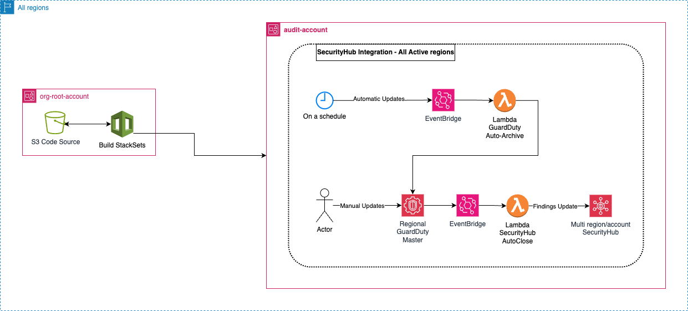

# AWS GuardDuty-SecurityHub Integration
Automatically resolve SecurityHub findings generated by GuardDuty

## Table of Contents
- [AWS GuardDuty-SecurityHub Integration](#aws-guardduty-securityhub-integration)
  - [Table of Contents](#table-of-contents)
  - [Intro](#intro)
  - [What it does](#what-it-does)
  - [How it works](#how-it-works)
  - [Usage](#usage)

## Intro
GuardDuty is natively integrated with SecurityHub so that findings created in GuardDuty also generate findings in SecurityHub. Unfortunately this integration stops there, if a finding gets archived in GuardDuty it remains active in SecurityHub.

This repo aims to fix this issue.

## What it does
This repo contains 2 templates:
* guardduty-securityhub-autoclose.yaml: this template ensures that when a GuardDuty finding is archived, the relevant finding in SecurityHub is set to RESOLVED.
* guardduty-autoarchive.yaml: this template automatically archives GuardDuty findings based on age and severity (both customizable), and the archive event is then picked up by the resources created by the previous template to also set the corresponding SecurityHub findings to RESOLVED.

## How it works
Assumptions:
* The design assumes that an audit account has been created and configured as delegated administrator for both SecurityHub and GuardDuty.
* The below needs to be deployed in all regions in which you have GuardDuty active.

The guardduty-securityhub-autoclose.yaml StackSet deploys the following:
* an EventBridge rule
* a Lambda function

When a GuardDuty finding gets archived, the `ArchiveFindings` event is intercepted by the EventBridge rule that then triggers a Lambda function that parses the event, gets its Id, and then updates the corresponding finding in SecurityHub.

The guardduty-autoarchive.yaml StackSet deploys the following:
* an EventBridge rule
* a Lambda function

The EventBridge rule is set to run on a schedule and triggers the Lambda function. The Lambda function gets the GuardDuty findings and archives the ones with a certain age and below a certain severity. The age and severity thresholds are both confgurable as parameters.

All logs generated by the 2 lambda functions above are saved in a custom CloudWatch Log Group, each with a retention period of 90 days.

The design is as it follows:

[Source](images/GuardDuty-SecurityHub-Integration.drawio)

## Usage
Deploy the templates via CloudFormation StackSets in the following order.

The guardduty-securityhub-autoclose.yaml gives you the possibility to customise the following parameters:
* the Lambda function name
* the EventBridge rule name 
* the name of the IAM role used by the Lambda function
* the region in which you're going to deploy this template (this then gets added to the IAM role name above and it is needed to avoid duplicate names in IAM)

The guardduty-autoarchive.yaml gives you the possibility to customise the following parameters:
* the Lambda function name
* the EventBridge rule name 
* the name of the IAM role used by the Lambda function
* the region in which you're going to deploy this template (this then gets added to the IAM role name above and it is needed to avoid duplicate names in IAM)
* The age of the findings that we want to archive in months (anything matching or above that will be archived)
* The maximum severity of the findings that we want to keep active, the ones below this severity level will be archived