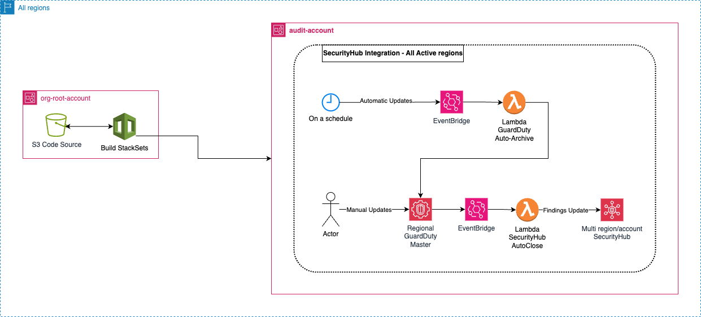

# AWS GuardDuty - SecurityHub CSPM Integration
Automatically resolve SecurityHub CSPM findings generated by GuardDuty.

## Table of Contents
- [AWS GuardDuty - SecurityHub CSPM Integration](#aws-guardduty---securityhub-cspm-integration)
  - [Table of Contents](#table-of-contents)
  - [Intro](#intro)
  - [What it does](#what-it-does)
  - [Design](#design)
  - [Deployment and Customization](#deployment-and-customization)
    - [guardduty-securityhub-autoclose.yaml](#guardduty-securityhub-autocloseyaml)
    - [guardduty-autoarchive.yaml](#guardduty-autoarchiveyaml)
  - [Common configuration](#common-configuration)

## Intro
GuardDuty is natively integrated with SecurityHub CSPM so that findings created in GuardDuty also generate findings in SecurityHub CSPM. Unfortunately this integration stops there, if a finding gets archived in GuardDuty it remains active in SecurityHub CSPM.

This repo aims to fix this issue.

## What it does
This repo contains 2 templates:
* `guardduty-securityhub-autoclose.yaml`: this template ensures that when a GuardDuty finding is archived, the relevant finding in SecurityHub CSPM is set to RESOLVED.
* `guardduty-autoarchive.yaml`: this template automatically archives GuardDuty findings based on age and severity (both customizable), and the archive event is then picked up by the resources created by the previous template to also set the corresponding SecurityHub CSPM findings to RESOLVED. This second template is optional.

## Design
Assumptions:
* The design assumes that: 
  * an audit account has been created and configured as delegated administrator for both SecurityHub CSPM and GuardDuty.
  * SecurityHub CSPM is configured with Cross-Region aggregation.

The design is as it follows:

*Figure 1: GuardDuty-SecurityHubCSPM Integration Design*

[Design Source - draw.io](https://github.com/alexbar-hub/aws-guardduty-securityhub-cspm-integration/blob/main/images/guardduty-securityhub-cspm-integration.drawio)

## Deployment and Customization
Deploy the templates via CloudFormation StackSets in the following order.

### guardduty-securityhub-autoclose.yaml
This template needs to be deployed first and only in the SecurityHub CSPM aggregator/home region.

This template gives you the possibility to customise the following parameters:
* the Lambda function name.
* the EventBridge rule name.
* the name of the IAM role used by the Lambda function.
* the region in which you're going to deploy this template (this then gets added to the IAM role name above and it is needed to avoid duplicate names in IAM).

When a GuardDuty finding gets archived, the `ArchiveFindings` event is intercepted by the EventBridge rule that then triggers a Lambda function that parses the event, gets its Id, and then updates the corresponding finding in SecurityHub CSPM.

### guardduty-autoarchive.yaml
This template needs to be deployed second and in all regions in which you have GuardDuty active.

This template gives you the possibility to customise the following parameters:
* the Lambda function name.
* the EventBridge rule name.
* the name of the IAM role used by the Lambda function.
* the region in which you're going to deploy this template (this then gets added to the IAM role name above and it is needed to avoid duplicate names in IAM).
* The age of the findings that we want to archive in months (anything matching or above that will be archived).
* The maximum severity of the findings that we want to keep active, the ones below this severity level will be archived.

The EventBridge rule is set to run on a schedule and triggers the Lambda function. The Lambda function gets the GuardDuty findings and archives the ones with a certain age and below a certain severity. The age and severity thresholds are both confgurable as parameters.

## Common configuration
All logs generated by the two lambda functions above are saved in a custom CloudWatch Log Group, with a retention period of 90 days.